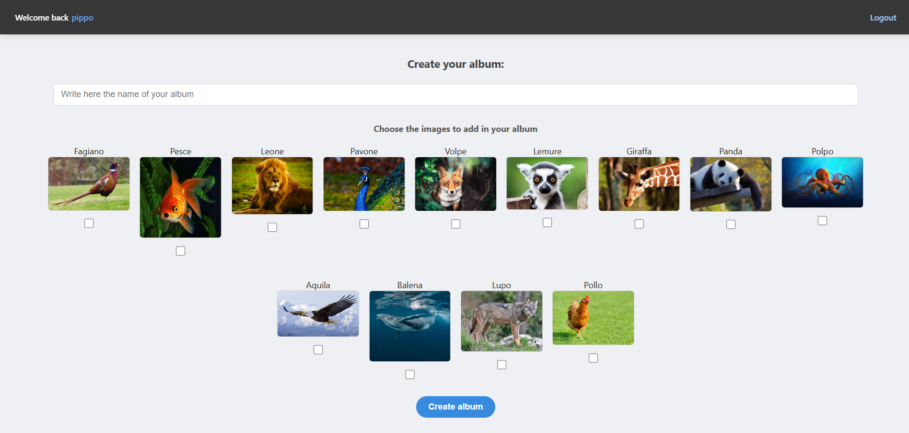
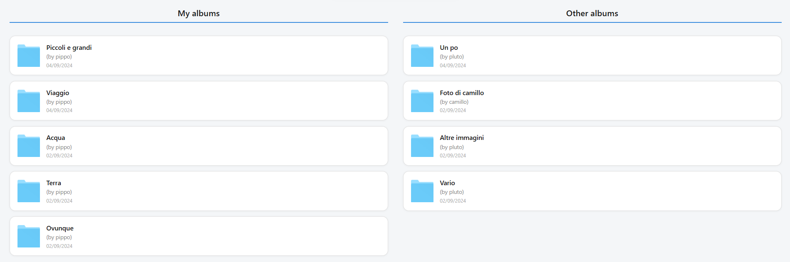
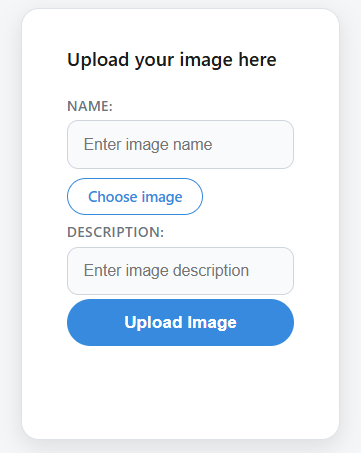
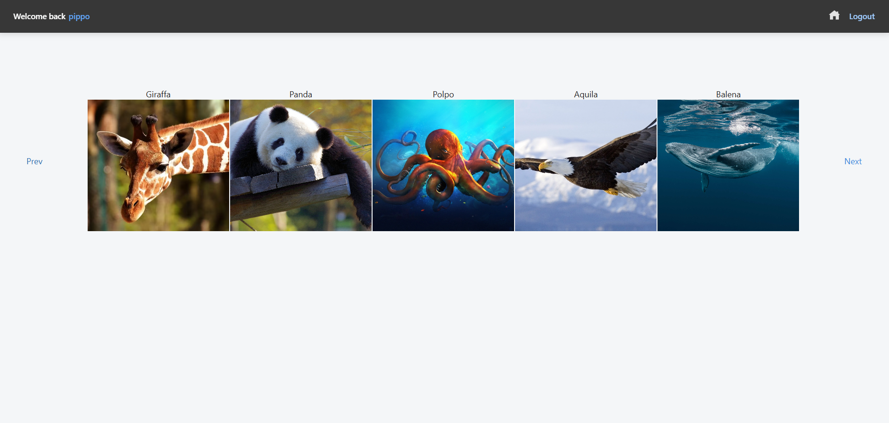
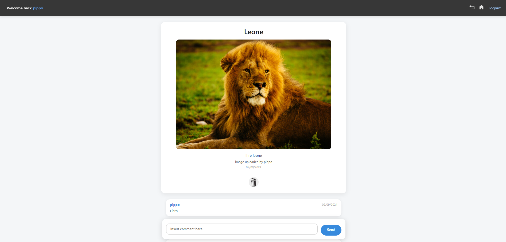

# 🖼️ Web Information Technologies Project A.A. 2023-2024

## 📝 Project Description
This project is a web application designed to manage an image gallery. It was developed in two distinct versions throughout the course: a **pure HTML version** and a **JavaScript (Rich Internet Application)** version.

The application allows users to register, log in, and manage their personal photos. Users can upload images directly to the server's file system, create custom albums, and associate their uploaded images with one or more albums. Additionally, the platform features a social component where users can view albums created by others and leave comments on individual images.

The JavaScript version upgrades the user experience by turning the app into a Single-Page Application (SPA) after login. It introduces features like client-side pagination, modal windows for viewing image details, and a drag-and-drop interface allowing users to create and save a custom sorting order for images within their albums.

---

## 📸 Screenshots

### 🏠 Home Page Dashboard
Manage your content and explore the gallery from the main dashboard.

**1. Create Album**

  

 

**2. Your Albums & Community Albums**

  

 

**3. Upload an Image**

  

 

### 📂 Album View
Viewing the contents of an album, displaying thumbnails paginated in groups of five.

  

 

### 🖼️ Image Details View
Viewing a full-size image along with its details and user comments. *(In the JS version, this opens as a modal window).*

  

---

## 📚 Resources & Documentation

* 📜 **[Project Specifications](https://github.com/SimoPolimi/TIW_2024/blob/master/Documents/Progetti_TIW_2023_2024.pdf)**: Technical requirements of the project.
* 📖 **[Project Documentation](https://github.com/SimoPolimi/TIW_2024/blob/master/Documents/Documentazione_gallery.pdf)**: Technical details, sequence diagrams, and application design.
* 🗄️ **[Database SQL Script](https://github.com/SimoPolimi/TIW_2024/blob/master/db_progetto.sql)**: SQL code used to generate the database and tables.
